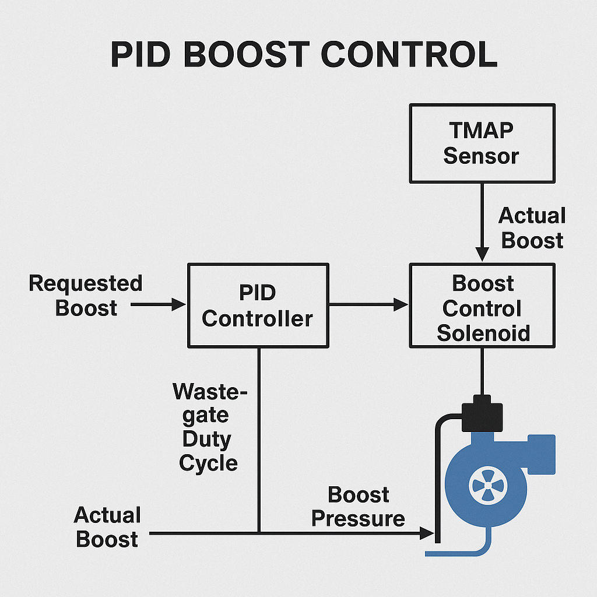

# BMW N54 Boost Control – PID and Tuning Limits

[BMW N54 Boost Control – PID and Tuning Limits](https://bootmod3.com/blogs/news/90834947-bmw-n54-boost-control-pid-and-tuning-limits)

```bash
Given recent developments in flash based tuning we wanted to offer our insight into the inner workings of the N54 DME when it comes to boost control tuning or more specifically, PID based boost control.

Boost control in the N54 OEM DME as well as most modern electronic boost controllers out there is based on what is called a PID algorithm. PID algorithms aren’t exclusive to boost control and are applied to various systems where correction to a signal can be applied by feeding the actual value of the signal through the algorithm and adjusting control for it automatically by comparing setpoint/requested to actual and adjusting the controlling device which in the case of boost control is pulse to a boost control solenoid.

Concept of a PID algorithm is quite simple. It is based around knowing two values:

1) Setpoint – in the case of boost control this is requested boost pressure that the DME is targeting for a given Load
2) Actual Value fed into the PID algorithm – in the case of N54 boost control this is the signal coming from the OEM TMAP sensor feeding back a 0-5V value representing absolute pressure

DME converts the analog 0-5V signal coming off of the TMAP sensor into engineering units based on the Map Conversion table you can find in your maps.

OEM TMAP sensor is a 2.5bar sensor. That means it can read 2.5bar of absolute pressure. This means your actual boost will vary based on your atmospheric/barometric pressure which needs to be subtracted from 2.5bar to understand how much readable range you’ve got out of your MAP sensor. This readable range above your barometric is what is referred typically as the word we all love and we’re here for, “BOOST” (i.e. positive pressure or pressure above barometric).

The OEM N54 DME works on the principle of Load based tuning and PID based boost control. Load is a calculation based on various parameters primarily around “boost” (i.e. pressure at the MAP sensor – barometric presure) and charge air temp which in turn calculate into Mass Air Flow (MAF). N54 doesn’t use a MAF sensor to meter airflow on the intake side. It calculates/infers it based on other values mentioned.

In order to make boost from the turbos the DME regulates boost control solenoids via a PWM (pulse-width modulated) signal pulsing them and allowing vacuum to hit the wastegate actuator. The frequency of that pulse/signal is what is typically referred to as wastegate duty cycle (WGDC). This is where PID based boost control comes in and helps the DME regulate the amount of WGDC applied to the solenoids so that Target Load is hit as required.

Very few of us speak about our tunes in terms of target load and it makes sense as most are used to talking about “Boost”. While the DME targets a given load and given that Load is defined based on primarily boost+IAT+compressor maps and airflow modelling around stock turbos/intakes/intake pipes it ends up calculating a Requested Boost level. In your Cobb datalogs you can monitor this value by looking at the Req. Boost Abs. channel.

You can refer to the Req. Boost Abs. as the DME’s Setpoint for the PID based algorithm. When using Cobb’s ATR software there is a hard limit at 1.28bar in terms of maximum Requestable boost. If for any reason your car boosts past this level the DME’s safety mechanism will kick in to prevent motor damage due to what it perceives as an uncontrollable boost condition for its settings. For a tuner using ATR to get around this issue and provide a smooth tune they need to effectively remove this first DME safety by calibrating tables related to boost control and throttle management. In other words, if at any point in time the turbos were to spike boost and cause it to overshoot target to say 35psi instead of where they’ve set/expect your tune to be, given how they’ve set the DME tables up to get that extra 2-5psi out of your car, it ends up being quite unsafe and won’t have the DME intervene as it normally should/would. With appropriate PID control and DME failsafes in place the signal to the solenoids is taken way, DME closes throttle causing DVs/BOV to open and vent boost and the DME goes into limp mode.

If you’ve been around the N54 scene long enough or even owned an N54 for while, especially a tuned one, you know that there are countless N54s out there that have had an experience with either overboost (30FE) or underboost (30FF) induced limp mode issues that otherwise could’ve ended up in a tune that knocked damaging the motor potentially ending in a really unnecessary and expensive repair.

Some N54 ROMs, such as the I8A0S and IJE0S, have had support added by Cobb (i.e. race code) so that the full range of the OEM TMAP sensor can be tuned with PID based boost control and the DME safety net entirely in place. It is only available with AccessTuner Pro (ATP) software and only by request to Cobb from a licensed protuner shop.

Even with the above race code in place going past the limits of the OEM TMAP sensor with flash only tuning carries an extreme level of risk for a motor. N54 is a stout motor that we all know can take quite a beating but that hasn’t prevented engine failures in the past due to various reasons but also due to poor and unsafe tuning.

If you’re running a flash-only tune on your N54 today, with or without the N20 3.5bar capable TMAP sensor, the hard limit is in place for the readable boost range of 2.5bar absolute (~21.5-22psi at sea level) inside which the DME’s boost safety mechanism works. This is also the range in which PID based boost control has authority to adjust your boost. If your tune is pushing past 22psi rest assured that even though some tuners love throwing the word PID in their descriptions that PID simply doesn’t exist and is virtually eliminated. Why? As mentioned before, PID based boost control revolves around knowing the actual boost. If you’re seeing boost flatline in your logs at ~21psi it is at that point that PID based boost control and safety has basically gone out the window for your car/DME and all you’re left with basically is the wastegate duty cycle which is mapped based on what is now a really skewed MAF calculation.

Can you make power in this way? You sure can, but so could the old versions of popular piggybacks before CANBus days. There will always be multiple ways of making power on any given motor. We’ve also shown that pushing past the TMAP sensor limit is quite doable setting a former N54 HP/TQ record on a beta Stage 3 VTT twin setup. However, the difference at least with us is that we explicitly stated that such tuning is not recommended and WILL NOT be provided for any customer car given boost control safety mechanisms aren’t in place. We are not ones to hand responsibility of appropriate tuning and throw risk into customer hands or make them stare at a boost gauge in hopes that they’ll react in time to save their motor from uncontrollable boost spikes. It is also why we recommend going with an external form of boost control when tuning any car past its OEM TMAP sensor as there simply isn’t any other proper way of doing it and certainly no way of using PID based boost control.

Dyno glory numbers and tinkering are always fun and certainly help marketing buzz but its one thing to make power and another to do it with appropriate safety and control in mind. Bottom line is, if you see anyone claiming PID based boost control while going past the TMAP limit you can refer them to this thread and let them know they’re missing a key piece of information to claim effective PID based control. You can also ask them what happens if your wastegate actuator sticks (not uncommon especially with wear on the turbos) or a boost control solenoid fails in the open position or when the car is already tuned to the edge at altitude and you drive down to sea level with the same map and heavily overboost. Not pretty, potentially very costly, irresponsible and just plain unnecessary given how far the N54 has come.
```

The article you quoted from **bootmod3** offers a deep dive into how **boost control** works on the **BMW N54 engine**, specifically when it’s tuned via flash tools like **Cobb AccessTuner** or **bootmod3**, and how **PID control** and **sensor limitations** play a critical role in safe and effective tuning.

Here’s a **simplified but detailed breakdown** of the key concepts and technical implications:

---

### 🔧 **What is PID-Based Boost Control?**

**PID** stands for:

* **P**roportional
* **I**ntegral
* **D**erivative

These are mathematical components used to adjust how the DME (Digital Motor Electronics, i.e., the ECU) regulates **boost pressure** by:

1. Comparing **target (setpoint)** boost to **actual** boost.
2. Adjusting the **wastegate duty cycle (WGDC)** accordingly, to keep boost close to the target.

---

### 📍 **Key Values in N54 Boost Control**

1. **Setpoint = Requested Boost**

   * The DME uses a load-based model to calculate what boost is needed for a given engine load.
   * This value is observable as `Req. Boost Abs.` in logs.
   * It's not *always* in PSI – it's absolute pressure in bar or kPa.

2. **Actual = Measured Boost**

   * Comes from the **TMAP sensor** (0–5V analog signal).
   * The stock N54 TMAP sensor reads up to **2.5 bar absolute** (\~22 psi at sea level).
   * Actual **Boost = TMAP reading – Atmospheric pressure (\~1 bar)**.

---

### 🧠 **How the DME Controls Boost**

* The DME pulses the **boost control solenoids** via **PWM signals** (WGDC).
* These solenoids control **vacuum to the wastegates**, which in turn regulate turbo boost.
* The PID algorithm adjusts WGDC to match target boost.

---

### ⚠️ **Dangers and Limitations of OEM PID Control**

1. **Sensor Limitation**

   * The stock TMAP can't read above **2.5 bar absolute** (\~22 psi at sea level).
   * Anything above that is "invisible" to the DME = PID can’t function properly anymore.

2. **Cobb ATR Hard Limit**

   * ATR (AccessTuner Race) limits boost setpoints to **1.28 bar (\~18.5 psi)**.
   * To go beyond, tuners must disable DME safeties—very risky if not done properly.

3. **What Happens When You Overboost**

   * If boost goes beyond readable range:

     * DME thinks control is lost.
     * Might **cut throttle**, open BOVs, or **go into limp mode**.
   * Or worse, if safety tables are disabled—it won’t intervene.

---

### 🔥 **What Happens When You Push Beyond Limits**

* **Past 22 psi:** DME **cannot see** real boost.
* **PID is gone.** The system is blind and runs on **pre-set WGDC maps**.
* **Tuning becomes dangerous**: You’re relying on good luck or external boost controllers.
* **MAF inference gets skewed**, affecting load, ignition, and fuel maps.

---

### 🧰 **Solutions and Safe Practices**

* Upgrade to a **3.5 bar TMAP (N20 sensor)** and re-scale maps.
* Use **external boost controllers** (like JB4 or a standalone EBC) if you must go higher.
* Ensure DME still has **functional safeties** (don’t disable them without reason).
* Only let **experienced tuners** work on tunes with PID alterations or race code.
* Monitor **30FE (overboost)** and **30FF (underboost)** codes closely.

---

### 💡 Summary of Takeaways

| Component       | Role                  | Notes                                     |
| --------------- | --------------------- | ----------------------------------------- |
| **DME**         | Brain of the engine   | Manages load-based tuning & boost via PID |
| **TMAP Sensor** | Reads actual pressure | Stock: 2.5 bar absolute = \~22 psi limit  |
| **PID**         | Controls WGDC         | Only works if DME can see actual boost    |
| **WGDC**        | Controls wastegates   | Adjusted to hit target boost              |
| **Cobb ATR**    | Tuning platform       | Has boost request limit of 1.28 bar       |
| **Safety**      | Cuts boost if unsafe  | Can be overridden – but not recommended   |

---

### ✅ Final Thoughts

Tuning the N54 beyond stock sensor limits without proper tools or knowledge is **highly risky**. The **key to reliable power** is **control**, and **control comes from accurate feedback**. When the DME can’t “see” boost, you’ve lost control—and the only thing standing between you and engine damage is dumb luck or external safety measures.


Yes, **that's exactly why**: bootmod3 **does not officially support the N54** on their website anymore. Here's why and what your options are:

---

### 🔎 **Why bootmod3 doesn't support N54**

1. **N54 DME is older and complex**:

   * It uses a **load-based tuning model** with **PID boost control**, but it wasn’t designed for high boost flexibility without hitting safety limits.
   * Flash-based tuning past **22 psi** becomes **unsafe**, since the OEM **2.5 bar TMAP** sensor can’t read higher boost.

2. **Tuning safety becomes limited**:

   * If you exceed the sensor’s readable range, the DME **loses its PID feedback loop**.
   * That means the **boost control becomes open-loop**, risking **boost spikes, limp mode, or even engine damage**.

3. **bootmod3’s philosophy**:

   * They prefer **full DME control** and **safe, closed-loop tuning** with safeguards in place.
   * Since the N54 can't reliably deliver this above stock sensor limits without hardware changes, they **don’t offer a product** for it anymore.

---

### ✅ **Can you still tune an N54 safely?**

Yes — but **only if it’s done properly**:

#### **Option 1: Use COBB AccessTuner Pro with a Pro Tuner**

* Some N54 ROMs (e.g. **IJE0S**, **I8A0S**) support **“race code”**, which extends PID and safety range.
* Requires **licensed tuner** and **AccessTuner Pro**.
* You can use an **N20 3.5 bar TMAP sensor** with the proper scaling for safer high-boost tuning.

#### **Option 2: MHD Flasher**

* MHD **does support N54** and is very popular in the community.
* Offers **off-the-shelf (OTS) maps** and **custom tuning support**.
* It includes safety features like **boost limiters**, **throttle closure**, and **PID tuning tables**.
* Compatible with **upgraded TMAP sensors** and **external boost control**.

#### **Option 3: JB4 + Backend Flash (BEF)**

* **JB4** acts as a **piggyback controller** and handles boost control externally.
* You combine it with a **backend flash** via MHD or Cobb for fuel, timing, and VANOS tuning.
* Allows tuning beyond DME limitations while still monitoring critical parameters.

---

### ⚠️ **Bottom line**

* **Yes**, the N54 can be tuned to be fast and reliable — but **you must respect its limitations**.
* To go beyond 22 psi, use:

  * A **3.5 bar TMAP**
  * **Proper tuning software** (MHD, Cobb ATP)
  * Possibly an **external boost controller or piggyback** (like JB4)
* **Never trust a tuner** who disables safeties without a backup plan or logging strategy.

---
Here is a **safe and proven configuration** for tuning your **BMW N54** to around **400–500whp**, with all the critical components and tuning strategy included:

---

## 🔧 SAFE 400–500whp N54 TUNING CONFIGURATION

### 🧠 **DME / Tuning Software**

* ✅ **MHD Flasher**

  * Most widely used for N54 tuning.
  * Supports **OTS maps** and **custom tuning**.
  * Full support for 3.5 bar TMAP, logging, flash counter reset, DME unlocks.
  * **Cost-effective and reliable**.
* OR
* 🔒 **Cobb AccessTuner Pro (ATP)** *(Pro tuner only)*

  * Only if you have a supported ROM (IJE0S/I8A0S).
  * Requires **pro tuner + race code** enabled.

---

### 🔄 **Boost Control Strategy**

* ✅ **Use a 3.5 bar TMAP sensor**

  * **N20 sensor** (BMW part #13-62-8-641-994)
  * Allows boost monitoring up to \~36 psi absolute (\~21 psi boost over 1 bar)

* ✅ **Calibrate TMAP scaling in tune** (MHD handles this with preset option)

* 🛑 **DON’T exceed OEM PID range (22 psi)** unless:

  * You are using **external boost control** (e.g., JB4 or MAC solenoid).
  * OR have a tuner who configures **open-loop WGDC tables** very carefully.

---

### ⚙️ **Hardware Upgrades Required**

| Component                      | Recommendation                  | Notes                                             |
| ------------------------------ | ------------------------------- | ------------------------------------------------- |
| **Intercooler**                | VRSF 7” HD / 7.5”               | Prevents heat soak                                |
| **Downpipes**                  | VRSF or AR catted/catless       | Removes flow restriction                          |
| **Chargepipe**                 | Aluminum + BOV flange           | Stock one cracks under pressure                   |
| **Blow-Off Valve**             | Tial Q / HKS                    | Prevents boost leaks at high boost                |
| **Upgraded TMAP Sensor**       | N20 3.5 bar                     | Allows boost tracking above 22 psi                |
| **High-Flow Intake**           | Dual cone (DCI)                 | Better airflow and turbo sound                    |
| **Inlets (optional)**          | 2” silicone inlets              | Required for full turbo spool if upgrading turbos |
| **Upgraded Turbos (optional)** | VTT GC / RB Twos / Pure Stage 2 | Needed for 500+whp                                |

---

### 💦 **Fueling Mods for 500whp+**

| Component                           | Recommendation                    |
| ----------------------------------- | --------------------------------- |
| **LPFP** (Low Pressure Fuel Pump)   | Walbro 450 or Stage 2 bucketed    |
| **Upgraded Fuel Lines**             | Optional but recommended          |
| **Port Injection or PI controller** | Required for **E85 blends > E40** |
| **Fuel-it! Sensor + App**           | For real-time ethanol content     |

---

### 💻 **Recommended Sensors to Monitor**

* **Boost (Actual & Target)**
* **WGDC Base & After PID**
* **Timing Correction Cyl 1–6**
* **IAT / Coolant / Oil Temps**
* **STFT / LTFT**
* **Lambda (Bank 1 and 2)**
* **Throttle Position / Closure Angle**
* **Rail Pressure / Injector Duty Cycle**

(MHD has all these channels in its logger.)

---

### 🧪 Fuel Strategy

| Target Power | Fuel Required                   |
| ------------ | ------------------------------- |
| \~400whp     | 93 octane + OTS Map             |
| \~450whp     | 93 + E30 blend                  |
| 500+whp      | E40–E60 + custom tune           |
| 550+whp      | Full E85 + PI or Meth Injection |

---

### ✅ Summary

| ✔️ Must-Haves            | 🚫 Avoid                           |
| ------------------------ | ---------------------------------- |
| MHD + 3.5 bar TMAP       | Tuning over 22 psi on stock sensor |
| Intercooler + chargepipe | Relying only on open-loop WGDC     |
| Proper fueling           | Disabling DME safeties completely  |
| Good logging habits      | Unknown/cheap tuners               |

---

