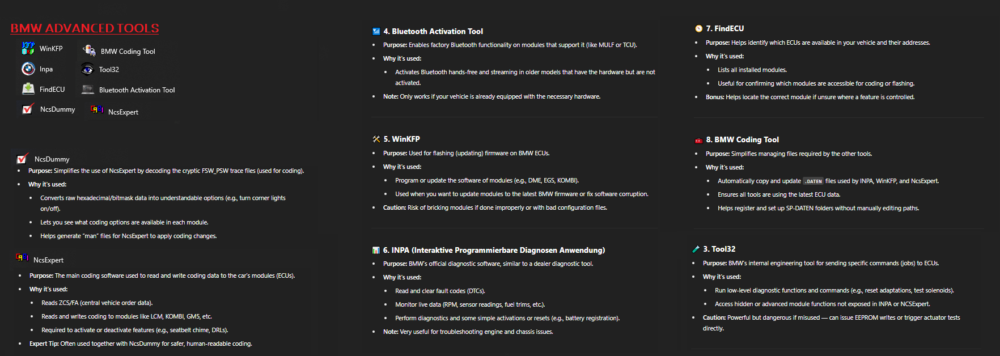
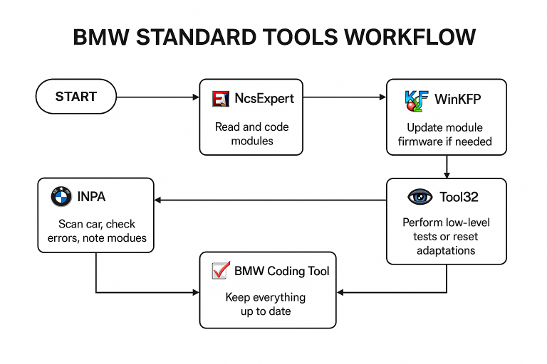
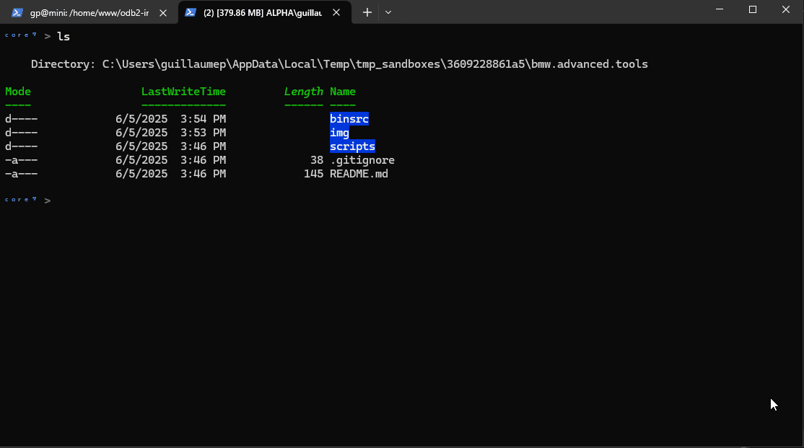

# BMW Advanced Tools



**BMW Standard Tools** (also known as BMW Advanced Tools), a powerful suite of diagnostic and coding utilities used primarily with E-series BMWs. 

Here's a breakdown of each tool and its function:


### 🔧 **1. NcsDummy**

* **Purpose:** Simplifies the use of NcsExpert by decoding the cryptic FSW\_PSW trace files (used for coding).
* **Why it's used:**

  * Converts raw hexadecimal/bitmask data into understandable options (e.g., turn corner lights on/off).
  * Lets you see what coding options are available in each module.
  * Helps generate “man” files for NcsExpert to apply coding changes.

---

### 🧠 **2. NcsExpert**

* **Purpose:** The main coding software used to read and write coding data to the car's modules (ECUs).
* **Why it's used:**

  * Reads ZCS/FA (central vehicle order data).
  * Reads and writes coding to modules like LCM, KOMBI, GM5, etc.
  * Required to activate or deactivate features (e.g., seatbelt chime, DRLs).
* **Expert Tip:** Often used together with NcsDummy for safer, human-readable coding.

---

### 🧪 **3. Tool32**

* **Purpose:** BMW’s internal engineering tool for sending specific commands (jobs) to ECUs.
* **Why it's used:**

  * Run low-level diagnostic functions and commands (e.g., reset adaptations, test solenoids).
  * Access hidden or advanced module functions not exposed in INPA or NCSExpert.
* **Caution:** Powerful but dangerous if misused — can issue EEPROM writes or trigger actuator tests directly.

---

### 📶 **4. Bluetooth Activation Tool**

* **Purpose:** Enables factory Bluetooth functionality on modules that support it (like MULF or TCU).
* **Why it's used:**

  * Activates Bluetooth hands-free and streaming in older models that have the hardware but are not activated.
* **Note:** Only works if your vehicle is already equipped with the necessary hardware.

---

### 🛠️ **5. WinKFP**

* **Purpose:** Used for flashing (updating) firmware on BMW ECUs.
* **Why it's used:**

  * Program or update the software of modules (e.g., DME, EGS, KOMBI).
  * Used when you want to update modules to the latest BMW firmware or fix software corruption.
* **Caution:** Risk of bricking modules if done improperly or with bad configuration files.

---

### 📊 **6. INPA (Interaktive Programmierbare Diagnosen Anwendung)**

* **Purpose:** BMW’s official diagnostic software, similar to a dealer diagnostic tool.
* **Why it's used:**

  * Read and clear fault codes (DTCs).
  * Monitor live data (RPM, sensor readings, fuel trims, etc.).
  * Perform diagnostics and some simple activations or resets (e.g., battery registration).
* **Note:** Very useful for troubleshooting engine and chassis issues.

---

### 🧭 **7. FindECU**

* **Purpose:** Helps identify which ECUs are available in your vehicle and their addresses.
* **Why it's used:**

  * Lists all installed modules.
  * Useful for confirming which modules are accessible for coding or flashing.
* **Bonus:** Helps locate the correct module if unsure where a feature is controlled.

---

### 🧰 **8. BMW Coding Tool**

* **Purpose:** Simplifies managing files required by the other tools.
* **Why it's used:**

  * Automatically copy and update `.DATEN` files used by INPA, WinKFP, and NcsExpert.
  * Ensures all tools are using the latest ECU data.
  * Helps register and set up SP-DATEN folders without manually editing paths.

---

### 🔄 Typical Workflow

1. **INPA** – Scan the car, check for errors, note modules.
2. **NcsExpert** – Read and code modules.
3. **NcsDummy** – Translate FSW\_PSW trace files and prepare coding changes.
4. **Tool32** – Perform low-level tests or reset adaptations.
5. **WinKFP** – Update module firmware if needed.
6. **BMW Coding Tool** – Keep everything up to date.




## Encode and Decode Packages

### WHY

I wanted to archive a big ZIP file on Github. But as you can imagine, github prevents the usage of repositories to archive sizeable binaries like movies, audio files, zip files, etc...

### Concept

This is a script that will create a encrypted archive, then split it in parts of specified sizes (like with 7z) but in TEXT format with files suffixed in ```.cpp``` so GITHUB thinks this is source code.


#### Decode 

```powershell
./scripts/Decode.ps1
```


#### Encode

```powershell
./scripts/Encode.ps1
```

